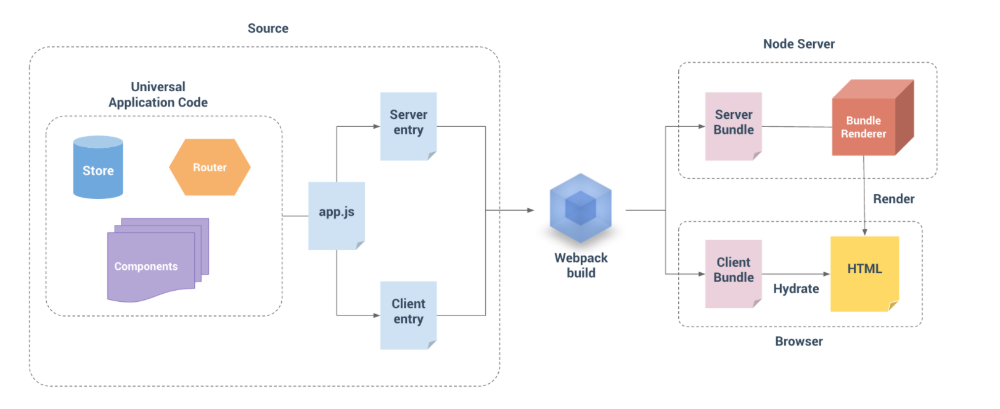

# ssr_2
前面**SSR(项目一)**只是简单的demo，没有加入路由等功能，这里我们将学习加入路由功能，如何将项目一分为二，也就是分为服务端渲染和客户端渲染，同时进行CSS样式抽离并渲染。

#### 官方渲染步骤

----

下面是Vue官方给出的一张服务器渲染示意图：




流程图大致意思是： 将Source（源码）通过webpack打包出两个bundle，其中Server Bundle是给服务端用的，服务端通过渲染器bundleRenderer将bundle生产html给浏览器用；另一个Client Bundle是给浏览器用的。服务端只是前期生成首屏所需的html，后期的交互和数据处理还是要能支持浏览器脚本的Client Bundle来完成的。接下来开始实现它：

####解决问题 

----

* 【首屏渲染问题】
* 【SEO解决搜索引擎抓取问题】
* 【提高页面性能】

#### 项目结构

----

```javascript
|-- buiild
    |-- webpack.base.config.js      #基本配置文件
    |-- webpack.client.config.js    #客户端配置文件
    |-- webpack.server.config.js    #服务端配置文件
|-- dist                            #存放生成的文件
|-- entry
    |-- entry-client.js             #client 入口文件
    |-- entry-server.js             #server 入口文件
|-- src
    |-- components
        |-- home.vue                #home组件
        |-- setting.vue             #setting组件
        |-- shop.vue                #shop组件
    |--router
       |-- index.js                 #路由
    |-- app.js                      #app入口文件
    |-- App.vue                     #顶级vue组件
    |-- index.template.html         #html 模版
    |-- server.js                   # server 的入口文件
|-- package.json
|-- package-lock.json
|-- README.md

```

####代码实现

安装依赖：

```
$ npm install
```


**package.json**

```json
{
  "name": "ssr_2",
  "version": "1.0.0",
  "description": "",
  "main": "index.js",
  "scripts": {
    "dev": "node server",
    "start": "cross-env NODE_ENV=production node server",
    "server": "webpack --config ./build/webpack.server.config.js",
    "client": "webpack --config ./build/webpack.client.config.js"
  },
  "author": "lwz",
  "license": "ISC",
  "dependencies": {
    "axios": "^0.16.0",
    "babel": "^6.23.0",
    "babel-plugin-transform-runtime": "^6.23.0",
    "babel-polyfill": "^6.26.0",
    "babel-preset-env": "^1.7.0",
    "body-parser": "^1.18.3",
    "compression": "^1.7.2",
    "express": "^4.15.4",
    "express-http-proxy": "^1.2.0",
    "http-proxy-middleware": "^0.18.0",
    "less": "^3.0.4",
    "less-loader": "^4.1.0",
    "vue": "^2.2.2",
    "vue-meta": "^1.5.0",
    "vue-router": "^2.2.0",
    "vuex": "^2.2.1",
    "vue-server-renderer": "^2.2.2",
    "vue-ssr-webpack-plugin": "^3.0.0",
    "vuex-router-sync": "^4.2.0"
  },
  "devDependencies": {
    "babel-core": "^6.26.3",
    "babel-loader": "^6.4.1",
    "babel-preset-es2015": "^6.24.1",
    "cross-env": "^5.2.0",
    "css-loader": "^0.28.4",
    "extract-text-webpack-plugin": "^2.1.0",
    "lru-cache": "^4.1.1",
    "source-list-map": "^2.0.0",
    "style-loader": "^0.18.2",
    "sw-precache-webpack-plugin": "^0.11.0",
    "url-loader": "^0.5.8",
    "vue-loader": "^11.1.4",
    "vue-template-compiler": "^2.2.4",
    "webpack": "^2.7.0",
    "webpack-merge": "^4.1.0",
    "webpack-node-externals": "^1.5.4"
  }
}

```


先看组件：

**(1)App.vue顶级组件**

```html
<!--App.vue-->
<template>
    <div id="app">
        <h1 class="title">服务端渲染SSR</h1>
        <router-link to="/home">首页</router-link>
        <router-link to="/shop">店铺</router-link>
        <router-link to="/setting">设置</router-link>
        <router-view></router-view>
    </div>
</template>
<script>

</script>
<style>
    .title {
        color: red;
    }
</style>
```


**(2)home.vue**

```html
<!--home.vue-->
<template>
    <div class="index">
        首页
    </div>
</template>
<script>
    export default {
        mounted() {

        }
    }
</script>
<style scoped>
    .index {
        color: red;
    }
</style>
```

**(3)setting.vue**

```html
<!--setting.vue-->
<template>
    <div>
        设置页面
    </div>
</template>
<script>
    export default {
        mounted() {

        }
    }
</script>
<style>

</style>
```

**(4)shop.vue**

```html
<!--shop.vue-->
<template>
    <div class="shop">
        店铺页面
    </div>
</template>
<script>
    export default {
        mounted() {

        }
    }
</script>
<style scoped>
    .shop {
        color: red;
    }
</style>
```

**(6)index.template.html   html模版**

```html
<!DOCTYPE html>
<html lang="en">
   <header>
       <title>{{title}}</title>
       <meta charset="UTF-8">
       <meta name="mobile-web-app-capable" content="yes"/>
       <meta http-equiv="X-UA-Compatible" content="IE=edge, chrome=1"/>
       <meta name="renderer" content="webkit"/>
       <meta name="viewport" content="width=device-width, initial-scale=1, maximum-scale=1, user-scalable=no, minimal-ui"/>
   </header>
   <body>
     <!--vue-ssr-outlet-->
   </body>
</html>
```

上面的基础代码就不解释了，接着看：

**路由router**

```vue
/* router index.js */
import Vue from 'vue';
import Router from 'vue-router';

Vue.use(Router);

export default new Router({
    // 去掉路由地址的#,因为#后面的内容不会发送至服务器，服务器不知道请求的是哪一个路由
    mode: 'history',
    routes: [
        {
            alias: '/', //起个别名
            path: '/home',
            component: require('../components/home.vue')
        },
        {
            path: '/shop',
            component: require('../components/shop.vue')
        },
        {
            path: '/setting',
            component: require('../components/setting.vue')
        }
    ]
});
```

Index.js作为vue实例创建路由的引用文件，这里的路由要记得上 mode: 'history' 这个选项，因为默认的路由方式是通过#后面的数据比那话来实现路由跳转的。而#后面的内容不会发送至服务器，因此服务端收到的永远是根文件index.html的资源请求，这样就无法根据路由信息来进行服务端渲染了。

**app.js  app入口文件**

```javascript
/* app.js */
import Vue from 'vue';
import App from './App.vue';
import router from './router';
import { sync } from 'vuex-router-sync';

// 导出一个工厂函数，用于创建新的vue实例
export function createApp(ssrContext) {
    // console.log("===router", router)
    const app = new Vue({
        router,
        ssrContext,
        render: h => h(App)
    });
    return {app, router};
}
```

App.js文件导出的是一个工厂函数，使用这个工厂函数回创建一个新的vue实例，这样可以隔离开各个客户端的请求，避免状态污染。每次客户端的请求，都会创建一个新的vue实例，接着对这个实例进行路由渲染，然后返回给客户端。

**entry-client.js client入口文件**

```javascript
/*entry-client.js*/
import { createApp } from "../src/app";
const { app, router } = createApp();

router.onReady(() => {
    app.$mount('#app')
});
```

客户端代码是在路由解析完成的时候挂在到 #app 标签下

**entry-server.js server入口文件**

```javascript
/* entry-server.js */
import { createApp } from "../src/app";
export default context => {
     // 因为这边 router.onReady 是异步的，所以我们返回一个 Promise
    // 确保路由或组件准备就绪
    return new Promise((resolve, reject) => {
        const { app, router } = createApp(context);

        //更改路由
        router.push(context.url);
        //获取相应路由下的组件
        const matchedComponents = app.$router.getMatchedComponents();

        //如果没有组件，说明该路由不存在，报错404
        if (!matchedComponents) {
            return reject({ code: 404 });
        }

        resolve(app);
    });
}
```

因为这里会有很多处理步骤，所以为了保证同步，使用promise函数来处理。当调用这个函数时，会创建一个新的vue实例，然后通过路由的push()方法，来更改实例的路由状态。更改完成后获取到该路由下将加载的组件，根据所得组件的长度来判断该路由页面是否存在。

**webpack 打包配置**

在上面大费周章实现带有路由的日常功能模版代码，接着我们需要利用webpack将上面的代码打包出服务端和客户端的代码，入口文件分别是 server-ertry.js 和 client-entry.js。

一般配置文件分为三个：base,client和server。基本配置(base config)包含在两个环境共享的配置，例如，输出路径(output path)，别名(alias)和 loader。服务器配置(server config)和客户端配置(client config)，可以通过使用 webpack-merge 来简单地扩展基本配置。

**webpack.base.config.js**

```javascript
/* webpack.base.config */
/*提取服务端和客户端公共对象*/

const path = require('path'); //获取路径对象
const webpack = require('webpack');
const ExtractTextPlugin = require('extract-text-webpack-plugin');//抽离css样式,防止将样式打包在js中引起页面样式加载错乱的现象
const isProd = process.env.NODE_ENV === 'production'; //判断运行环境
module.exports = {
    /*生产环境推荐：cheap-module-source-map 开发环境推荐：cheap-module-eval-source-map
    Webpack打包生成的.map后缀文件，使得我们的开发调试更加方便，它能帮助我们链接到断点对应的源代码的位置进行调试
    （//# souceURL），而devtool就是用来指定source-maps的配置方式的。*/
    devtool: isProd ? "#cheap-module-source-map" : "#cheap-module-eval-source-map",
    output: {
        path: path.resolve(__dirname, '../dist'),
        publicPath: '/',
        filename: '[name].[chunkhash].js' //用于长效缓存
    },
    resolve: {
        //在导入语句没带文件后缀时，Webpack 会自动带上后缀后去尝试访问文件是否存在,按顺序查找
        extensions: ['.js', '.vue', '.json'],
        //别名
        alias: {
            'vue': 'vue/dist/vue.runtime.min.js',
            '@': path.resolve('src'),
            '~': path.resolve('src/components')
        }
    },
    module: {
        //noParse 如果确定一个模块中没有其它新的依赖 就可以配置这项，webpack 将不再扫描这个文件中的依赖。
        noParse: [/es6-promise\.js$/],
        // 因为webpack2，这里必须是rules，如果使用use，会报错：vue this._init is not a function
        rules: [
            {
                test: /\.vue$/,
                use: {
                    loader: 'vue-loader',
                    options: {
                        preserveWhitespace: false,
                        postcss: [
                            require('autoprefixer')({ //处理浏览器兼容
                                browers: ['last 3 versions']
                            })
                        ]
                    }
                }
            },
            {
                test: /\.js$/,
                use: 'babel-loader',
                exclude: /node_modules/
            },
            {
                test: /\.(png|jpe?g|gif|svg)(\?.*)?$/, //自动hash命名图片等资源，并修改路径。路径需要根据项目实际情况确定
                use: {
                    loader: 'url-loader',
                    options: {
                        limit: 10000,
                        name: '[name].[ext]?[hash]'
                    }
                }
            },
            {
                test: /\.(woff2?|eot|ttf|otf)(\?.*)?$/,
                use: {
                    loader: 'url-loader',
                    options: {
                        limit: 10000,
                        name: 'fonts/[name].[hash:7].[ext]'
                    }
                }
            },
            {
                test: /\.css$/,
                use: ['vue-style-loader', 'css-loader']
            },
            {
                test: /\.less$/,
                use: ['vue-style-loader', 'css-loader', 'less-loader']
            },
            {
                test: /\.json$/,
                use: 'json-loader'
            },
            // {
            //     test: /\.(less|css)$/,
            //     use: isProd ?
            //         ExtractTextPlugin.extract({
            //             use: ['css-loader?minimize','less-loader'],
            //             fallback: 'vue-style-loader'
            //         }) :
            //         ['vue-style-loader', 'css-loader', 'less-loader']
            // }
        ]
    },
    //性能
    performance: {
        maxEntrypointSize: 300000, //超过300000bytes 警告提示
        hints: isProd ? 'warning' : false
    },
    plugins: [
        //抽离css样式
        new ExtractTextPlugin({
            filename: 'common.[chunkhash].css'
        }),
        new ExtractTextPlugin({
            filename: 'common.[chunkhash].less'
        })
    ]
}
```

**webpack.server.config.js**

```javascript
/*webpack.server.config.js*/
const webpack = require('webpack');
const path = require('path');
const merge = require('webpack-merge');
const base = require('./webpack.base.config');
const nodeExternals = require('webpack-node-externals');
const VueSSRServerPlugin =require('vue-server-renderer/server-plugin');
const projectRoot = path.resolve(__dirname, '..'); //根路径

module.exports = merge(base, {
    // 此处告知 server bundle 使用 Node 风格导出模块(Node-style exports)
    //这里必须是node，因为打包完成的运行环境是node，在node端运行的，不是在浏览器端运行
    target: "node",
    //对bundle render 提供source map支持
    devtool: '#source-map',
    // entry需要提供一个单独的入口文件
    entry: ['babel-polyfill', path.join(projectRoot, 'entry/entry-server.js')],
    //输出
    output: {
        //制定libraryTarget的类型为commonjs2，用来指定代码export出去的入口形式
        // 在node.js中模块是module.exports = {...},commonjs2打包出来的代码出口的形式九类似于此。
        libraryTarget: "commonjs2",
        path: path.join(projectRoot, 'dist'), //打包出的路径
        filename: "bundle.server.js" //打包最终的文件名，这个文件是给node服务器使用的
    },
    //外置化应用程序依赖模块。可以使服务器构建速度更快
    externals: nodeExternals({
        whitelist: /\.css$/
    }),
    plugins: [
        new webpack.DefinePlugin({
            'process.env.NODE_ENV': JSON.stringify(process.env.NOE_ENV || 'development'),
            'process.env.VUE_ENV': '"server"'
        }),
        // 这是将服务器的整个输出 构建为单个 JSON 文件的插件
        // 默认文件名为 'vue-ssr-server-bundle.json'，
        // 记录页面所有依赖文件列表，在生成最终HTML时方便注入相应的js链接和css链接。
        new VueSSRServerPlugin()
    ]
});
```

**webpack.client.config.js**

```javascript
/* webpack.client.config */
const path = require('path');
const webpack = require('webpack');
const merge = require('webpack-merge');
//缓存webpack打包的bundle js文件
const SWPrecchePlugin = require('sw-precache-webpack-plugin'); //用于使用service worker来缓存外部项目依赖项
const base = require('./webpack.base.config');
const VueSSRClientPlugin = require('vue-server-renderer/client-plugin');
const projectRoot = path.resolve(__dirname, '..'); //根路径

const config = merge(base, {
    entry: {
        app: path.join(projectRoot, 'entry/entry-client.js')
    },
    resolve: {
        alias: {
            'create-api': './create-api-client.js'
        }
    },
    plugins: [
        new webpack.DefinePlugin({
            'process.env.NOE_ENV': JSON.stringify(process.env.NOE_ENV || 'development'),
            'process.env.VUE_ENV': '"server"'
        }),
        new webpack.optimize.CommonsChunkPlugin({
            names: 'vendor',
            minChunks: function (module) {
                //一个模块被提取到vendor chunk时
                return (
                    //如果他在 node_modules 中
                    /node_modules/.test(module.context) &&
                    //如果 request 是一个 CSS 文件，则无需外置化提取
                    !/\.css$/.test(module.request)
                )
            }
        }),
        //重要信息： 这将webpack运行时分离到一个引导 chunk 中
        //以便可以在之后正确注入一步 chunk
        // 这也为应用程序/vendor代码提供了更好的缓存。
        new webpack.optimize.CommonsChunkPlugin({
            name: 'manifest',
            //chunks: ['vendors', 'vues']
        }),
        //此插件在输出目录中 生成 'vue-ssr-client-manifest.json'
        new VueSSRClientPlugin()
    ]
});

if (process.env.NODE_ENV === 'production') {
    config.plugins.push(
        new SWPrecchePlugin({ //将使用sw-precache生成service worker文件并将其添加到您的构建目录
            cacheId: 'vue-ssr',
            filename: 'service-eorker.js',
            minify: true,
            dontCacheBustUrlsMatching: /\.w{8}\./,
            staticFileGlobsIgnorePatterns: [/\.map$/, /\.json$/]
        })
    );
}

module.exports = config;
```

webpack 配置完成，其实东西也不多，都是常规配置。需要注意的是 `webpack.server.config.js` 配置，output是生成一个 commonjs 的 library， `VueSSRServerPlugin` 用于这是将服务器的整个输出构建为单个 JSON 文件的插件。

打包命令：

```
$ npm run server
$ npm run client
```

打包后会生成一些打包文件，其中 server.config 打包后会生成 `vue-ssr-server-bundle.json` 文件，这个文件是给 `createBundleRenderer` 用的,用于服务端渲染出 html 文件。

细心的你还会发现 client.config 不仅生成了一下客服端用的到 js 文件，还会生成一份 `vue-ssr-client-manifest.json` 文件,这个文件是客户端构建清单，服务端拿到这份构建清单找到一下用于初始化的js脚步或css注入到 html 一起发给浏览器。

**server.js 服务端渲染**

上面的都是准备工作，最重要的一步是将webpack构建后的资源代码给服务端用来生成html。我们需要用node写一个服务端应用，通过打包后的资源生成html并发送给浏览器。

```javascript
/* server.js */
const fs = require('fs');
const express = require('express');
const path = require('path');
const LRU = require('lru-cache');//LRU(Least Recently Used) '最近最少用的'
const { createBundleRenderer } = require('vue-server-renderer');

const resolve = file => path.resolve(__dirname, file);
const template = fs.readFileSync('./src/index.template.html', 'utf-8');
const isProd = process.env.NODE_ENV === 'production';
const server = express();

function createRenderer(bundle, options) {
    return createBundleRenderer(bundle, Object.assign(options, {
        template, //页面模版
        // 在固定的缓存空间下，把最近使用的数据移除，让给最新读取的数据，尽量保留访问最多的数据
        cache: LRU({
            max: 1000,
            maxAge: 1000 * 60 * 15
        }),
        //显式地声明 server bundle 的运行目录。运行时将会以此目录为基准来解析 node_modules 中的依赖模块
        //只有在所生成的 bundle 文件与外部的 NPM 依赖模块放置在不同位置，或者 vue-server-renderer 是通过 NPM link 链接到当前项目中时，才需要配置此选项。
        basedir: resolve('./dist'),
        // 默认true情况下，对于每次渲染，bundle renderer 将创建一个新的 V8 上下文并重新执行整个 bundle。但性能开销大
        runInNewContext: false
    }));
}

let renderer;
const bundle = require('./dist/vue-ssr-server-bundle');
const clientManifest = require('./dist/vue-ssr-client-manifest');
renderer = createRenderer(bundle, { clientManifest });
const serve = (path, cache) => express.static(resolve(path), {
    maxAge: cache && isProd ? 1000 * 60 * 60 * 24 * 30 : 0 //缓存时间设置
})
//use与get、post不同的是，他的网址不是精确匹配的。而是能够有文件夹拓展的
//提供静态资源 设置静态文件目录
//为了给静态资源文件创建一个虚拟的文件前缀(实际上文件系统中并不存在) ，可以使用 express.static 函数指定一个虚拟的静态目录
//http://localhost:8085/dist  使用 /dist 作为前缀来加载 ./dist 文件夹下的文件
server.use('/dist', serve('./dist', true));
server.use(serve(__dirname + '/dist'));
server.get('*', (req, res) => {
    // res.setHeader("Content-type", "text/html;charset=UTF-8");
    const context = {
        title: '服务端渲染SSR',
        url: req.url
    };
    console.log("==context===", context);
    //这里无需传入一个应用程序，因为在执行bundle 时已经自动创建过
    // 现在我们的服务器与应用程序已经解耦
    renderer.renderToString(context, (err, html) => {
        if (err) {
            return res.status(500).end('服务器错误！');
        }
        console.log("==html===", html);
        res.end(html);
    })
});

// 服务器监听地址
server.listen(8085, () => {
    console.log('===服务器已启动！===')
});
```

生成的html如下：

```html
<html lang="en">
   <header>
       <title>服务端渲染SSR</title>
       <meta charset="UTF-8">
       <meta name="mobile-web-app-capable" content="yes"/>
       <meta http-equiv="X-UA-Compatible" content="IE=edge, chrome=1"/>
       <meta name="renderer" content="webkit"/>
       <meta name="viewport" content="width=device-width, initial-scale=1, maximum-scale=1, user-scalable=no, minimal-ui"/>
   </header>
   <link rel="preload" href="/manifest.31873947e7298382978e.js" as="script"><link rel="preload" href="/vendor.5470e13311712b247522.js" as="script"><link rel="preload" href="/app.8479704cc7bc1f5c7524.js" as="script"><body>
     <div id="app" data-server-rendered="true"><h1 class="title">服务端渲染SSR</h1><a href="/home">首页</a><a href="/shop">店铺</a><a href="/setting">设置</a><!----></div><script src="/manifest.31873947e7298382978e.js" defer></script><script src="/vendor.5470e13311712b247522.js" defer></script><script src="/app.8479704cc7bc1f5c7524.js" defer></script>
   </body>
</html>


```

可以看到服务端把路由下的 组件 shop.vue 和setting.vue也给渲染出来了，而不是让客户端去动态加载，其次是html也被注入了一些<script>标签去加载对应的客户端资源。注意：服务端渲染出的html只是首次展示给用户的页面而已，用户后期操作页面处理数据还是需要js脚本去跑的，也就是webpack为什么要打包出一套服务端代码（用于渲染首次html用），一套客户端代码（用于后期交互和数据处理用）。

#### 运行项目

```
$ npm run server #打包服务端代码
$ npm run client #打包客户端代码
$ npm run dev    #dev模式下启动服务
$ npm run dev    #production模式下启动服务
```

访问路径：http://localhost:8085